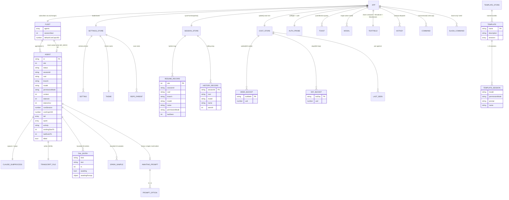
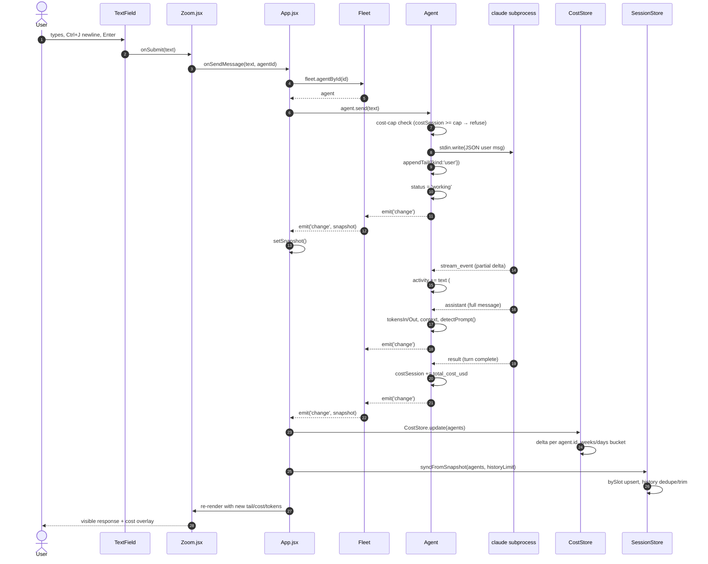
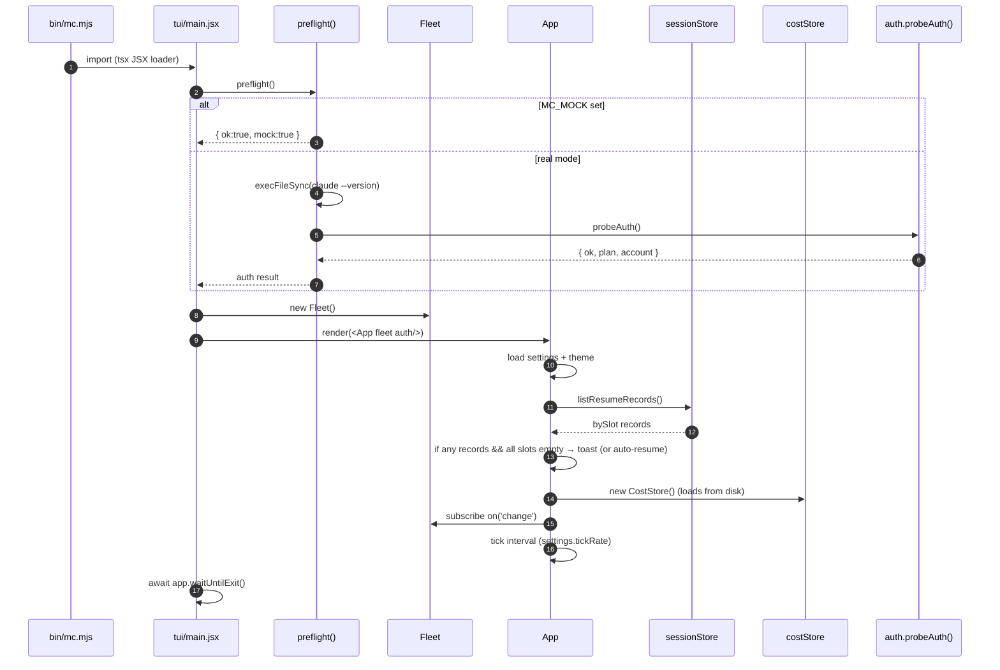

# ba-mission-control — Architecture & Entity Map

Generated 2026-06-09 by the systematic audit pass. Source of truth for
"what's actually in this repo, who calls what, where does state live."

Companion docs:
- `COMPONENTS.md` — per-component purpose, props, orphan flags
- `IMPROVEMENTS.md` — 500+ task backlog bucketed by category

---

## 1. Layered architecture

```
┌─────────────────────────────────────────────────────────────────┐
│ ENTRY                                                           │
│  bin/mc.mjs  → registers tsx loader → imports tui/main.jsx      │
└──────────────────────┬──────────────────────────────────────────┘
                       │
┌──────────────────────▼──────────────────────────────────────────┐
│ BOOT (tui/main.jsx)                                             │
│  preflight()  →  claude --version + claude auth status          │
│  new Fleet()                                                    │
│  render(<App fleet={fleet} auth={auth}/>)                       │
│  wire SIGINT/SIGTERM → fleet.killAll() + app.unmount()          │
└──────────────────────┬──────────────────────────────────────────┘
                       │
┌──────────────────────▼──────────────────────────────────────────┐
│ UI LAYER  (Ink + React)                                         │
│  App.jsx (1389 LOC, 23 useState — REFACTOR CANDIDATE)           │
│    Header · Aggregate · Card[] grid · FleetLog · StatusBar      │
│    Modals: Zoom · NewSession · Settings · Help · Broadcast      │
│            · Dashboard · RepoPicker                             │
│  Shared: TextField · themes · format · models · slashCommands   │
└──────────────────────┬──────────────────────────────────────────┘
                       │ snapshot/event bus
┌──────────────────────▼──────────────────────────────────────────┐
│ DATA LAYER  (in-process, no HTTP)                               │
│  Fleet (10 slots, EventEmitter, pub-sub snapshot)               │
│    Agent[] — one per slot, owns a `claude` subprocess           │
│    MockAgent — replays fixture instead of spawning claude       │
└──────────────────────┬──────────────────────────────────────────┘
                       │
┌──────────────────────▼──────────────────────────────────────────┐
│ PERSISTENCE                                                     │
│  ~/.config/claude-mc/sessions.json   — bySlot + history         │
│  ~/.config/claude-mc/settings.json   — user preferences         │
│  ~/.config/claude-mc/costs-week.json — week/day cost buckets    │
│  ~/.config/claude-mc/templates.json  — named session bundles    │
│  ~/.local/state/claude-mc/sessions/<id>.jsonl — transcript      │
│  ~/.claude/abtop-rate-limits.json    — plan usage (claude-side) │
└─────────────────────────────────────────────────────────────────┘
```

---

## 2. Entity-relationship diagram (ERD)



---

## 3. Message flow: user types in Zoom → claude reply renders



---

## 4. Boot sequence



---

## 5. State ownership boundaries

| Owner | State | Lives in | Persisted | Notes |
|-------|-------|----------|-----------|-------|
| Fleet | `agents[]`, `sessionStart`, `defaultCostCapUSD` | server/fleet.mjs in-memory | no | Lost on restart; restored by SessionStore |
| Agent | spawn handle, transcript writer, tail, spark, status, tokens, cost | server/agent.mjs in-memory | tail goes to transcript jsonl | Dies with subprocess |
| App | UI focus, modal, toasts, command-bar buffer, kill/quit-arm refs | tui/App.jsx React state | no | Per-session UI; resets on relaunch |
| SessionStore | bySlot map + rolling history | tui/lib/sessionStore.js | `~/.config/claude-mc/sessions.json` | Schema v2; trimmed at `settings.sessionHistoryLimit` |
| CostStore | week/day buckets + per-agent lastSeen | tui/lib/costStore.js | `~/.config/claude-mc/costs-week.json` | Rolls over Monday 00:00 UTC |
| SettingsStore | user preferences | tui/lib/settings.js | `~/.config/claude-mc/settings.json` | Schema-driven via SETTINGS_SCHEMA |
| TemplateStore | named session bundles | tui/lib/templateStore.js | `~/.config/claude-mc/templates.json` | Bundled defaults; user-extensible |

---

## 6. Event bus

| Emitter | Event | Triggered by | Payload | Listeners |
|---------|-------|--------------|---------|-----------|
| Agent | `'change'` | every stream event (throttled 50ms), state transitions, send, pause, resume, kill | (none — snapshot pulled on demand) | Fleet |
| Fleet | `'change'` | any Agent `'change'`, plus launch/kill/setCostCap | `{ sessionStart, now, agents: [...] }` snapshot | App.jsx (single subscriber) |
| Node | `'SIGINT' \| 'SIGTERM'` | OS | — | main.jsx shutdown handler |
| stdout | `'resize'` | TTY SIGWINCH | — | App.jsx termSize tracker |

---

## 7. Subprocess boundary (claude wire format)

`Agent.start()` spawns the `claude` CLI in stream-json mode:

```
claude
  --session-id <uuid>                  ← stable across restarts for resume
  --input-format stream-json
  --output-format stream-json
  --print
  --include-partial-messages
  [--model <id>]
  [--permission-mode plan|default|acceptEdits]
  [--resume]
  --add-dir <cwd>
```

**Inbound (proc.stdout):** newline-delimited JSON; routed by `event.type`:
- `system` (event: `init`) — session ready; resets restart backoff
- `stream_event` (content_block_delta) — partial text → `activity`
- `assistant` (full message) — append to tail, detect awaiting prompt, update tokens/context
- `user` — echo back (rare)
- `result` — turn done; folds in `total_cost_usd`

**Outbound (proc.stdin):** newline-delimited JSON; one shape:
```json
{ "type":"user", "message": {"role":"user","content":"<text>"} }
```

**Lifecycle signals:**
- `SIGSTOP` / `SIGCONT` — pause/resume (POSIX; doesn't terminate the process)
- `SIGTERM` — graceful kill
- `proc.on('exit')` → exponential-backoff auto-restart unless `killed:true`

---

## 8. Data-flow critical paths (high-traffic)

| Path | Hops | Frequency | Risk |
|------|------|-----------|------|
| Token stream → UI | claude → Agent#handle → Agent.emit → Fleet.emit → App.setSnapshot → React render | 50ms throttle (up to 20Hz) | Re-render storm if useMemo deps unstable (see IMPROVEMENTS) |
| User message → claude | TextField → Zoom → App.sendOne → Agent.send → proc.stdin | per Enter | Sync stdin.write blocks event loop if buffer full |
| Persist sessions | App.useEffect([snapshot]) → syncFromSnapshot → fs.writeFileSync | per snapshot | Silent persist failure = data loss |
| Cost tracking | App.useEffect([snapshot]) → CostStore.update → fs.writeFileSync | per snapshot | Same silent-failure pattern |
| Resize | TTY → stdout.on('resize') → setTermSize → re-layout | rare | Card width recomputation in render path |
| Auth probe | preflight (boot) + `:auth` verb | rare | execFileSync blocks boot ~3s on slow CLI |

---

## 9. File-system contract

| Path | Owner | Lifecycle | Failure mode today |
|------|-------|-----------|--------------------|
| `~/.config/claude-mc/sessions.json` | SessionStore | created on first sync; never deleted | Silent reset to empty on parse error → data loss |
| `~/.config/claude-mc/settings.json` | SettingsStore | created on first save; merges with defaults on load | Silent fallback to defaults on parse error |
| `~/.config/claude-mc/costs-week.json` | CostStore | created on first update | Silent reset on parse error → cost-tracking loss |
| `~/.config/claude-mc/templates.json` | TemplateStore | optional; bundled defaults if missing | Silently ignored on parse error |
| `~/.config/claude-mc/debug-keys.log` | TextField (`MC_DEBUG_KEYS=1` only) | append-only diagnostic | Silent open-fail if dir missing — TODO(debug-keys-mkdir) |
| `~/.local/state/claude-mc/sessions/<id>.jsonl` | Agent transcript | created on first send | Silent fail if FS read-only |
| `~/.claude/abtop-rate-limits.json` | external (claude CLI) | best-effort read | UI gracefully degrades when missing |

---

## 10. Trust boundaries (security map)

```
EXTERNAL TRUST                           ←  not trusted
  process.env (CLAUDE_BIN, ANTHROPIC_API_KEY, MC_MOCK, MC_DEBUG_KEYS)
  user input (composer, command bar, settings)
  filesystem (templates, settings — user can edit between launches)
                ↓
INTERNAL TRUST                           ←  trusted after validation
  Fleet, Agent, stores
                ↓
SUBPROCESS SURFACE                       ←  inherits full env today (gap)
  claude CLI                             ←  treated as cooperative
  git CLI                                ←  treated as cooperative
```

**Today's gaps** (covered in IMPROVEMENTS.md → SECURITY):
- `env: process.env` spread to spawn — no allowlist filtering
- `listMentionTargets()` does not enforce cwd containment
- `listRecentRepos()` does not resolve symlinks before parent-check
- `:slack <url>` does not validate domain
- Auth fallback to `ANTHROPIC_API_KEY` env leaks into summary

---

## 11. What this map is NOT

- Not a runtime-behavior spec — see in-code comments + tests for behavior contracts
- Not a release plan — see IMPROVEMENTS.md for prioritized backlog
- Not exhaustive on the React render tree — see COMPONENTS.md for the per-component matrix
- Not a substitute for reading `server/agent.mjs` before touching subprocess code
